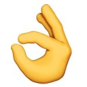

# Geture Recognition
We trained a gesture recognition model based on VGG16 network. It can recognize four kinds of 
hand gestures. You can also train with sparsity, prune and finetune to get a tiny-model with slight accuarcy drop. 
The method comes from [Learning Efficient Convolutional Networks through Network Slimming](https://arxiv.org/abs/1708.06519)
## Hand Gesture
Supported Hand Gesture as follow  
    
 

## train
```
python3 train.py --lr 0.1 --epochs 160 --weight-decay 5e-4 --mixup --alpha 0.2 
```

## Train with sparsity
```
python3 train.py --lr 0.1 --epochs 160 --weight-decay 5e-4 --mixup --alpha 0.2 --sr 
```

## Prune
```
python3 prune.py --model best_model_baseline.pth.tar --percent 0.7
```

## Finetune
```
python3 train.py --refine best_model_pruned.pth.tar --lr 0.01 --epochs 60 --weight-decay 5e-4
```
## Test
```
python3 test.py --model best_model_finetuned.pth.tar
```
## Result
|model|Accuarcy|  
|:----|:----:|  
|baseline|94.4%|  
|sparsity|93.6%|  
|pruned|20%|  
|finetuned|93%|

## Pretrained
pretrained [weights](https://pan.baidu.com/s/1CLllHXPK1cckMhDm_CYbJA)   
code: m73b

## Demo
You can test it by using the code from https://github.com/lippman1125/YOLOv3-complete-pruning
```
python3 detect.py --cfg cfg/yolov3-hand.cfg --data data/oxfordhand.data --weights weights/best.pt --source 0 --gesture ../gesture_recog/model_best_finetune.pth.tar 
```    
 

## Reference
>https://github.com/foolwood/pytorch-slimming
  


